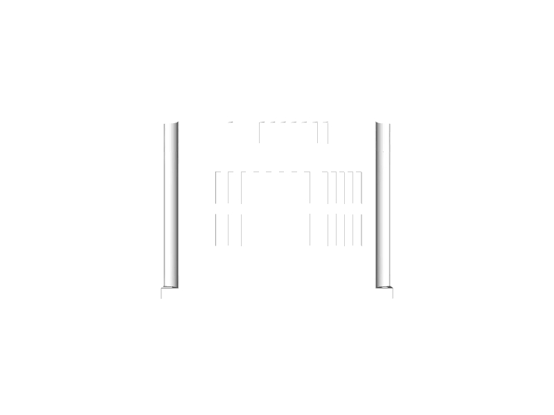

## 3.1 CAD/Assembly
The following image is the 3-D diagram of the designed house.

	
	<figcaption align="center">Fig 3.1.1: Front View</figcaption>

	 
	 <figcaption align="center">Fig 3.1.2: Side View</figcaption>

	 
	 <figcaption align="center">Fig 3.1.3: Top View</figcaption>

	  
	 <figcaption align="center">Fig 3.1.3: Orthographic View</figcaption>

The components of our energy solution are detailed as follows:

***Label 1*** - Solar Panels  
Solar panels to take the solar energy and give a DC current.

	 
	
	
	<figcaption align="center">Fig 3.1.4: Side View, Front View and Top View (L to R)</figcaption>

***Label 2*** - Inverter  
Takes the solar DC current and supply it power supply as well as store it in battery.

	 
	
	
	<figcaption align="center">Fig 3.1.5: Side View, Front View and Top View (L to R)</figcaption>

***Label 3*** - Battery  
Stores the solar converted electrical energy for further use when solar power cannot be harnessed e.g. Night. 

	 
	
	
	<figcaption align="center">Fig 3.1.5: Side View, Front View and Top View (L to R)</figcaption>

---