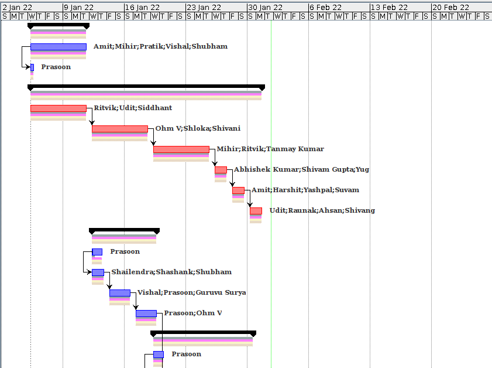
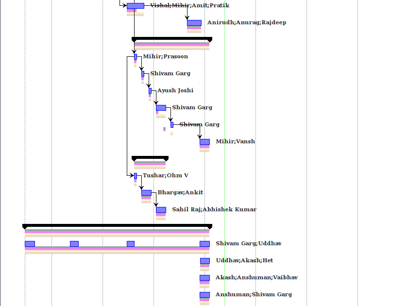
The red path in the above Gantt Chart shows the critical path. It was closely monitored so that there were no delays in the corresponding works.

The following shows the start dates and durations of various sub-teams in the project:

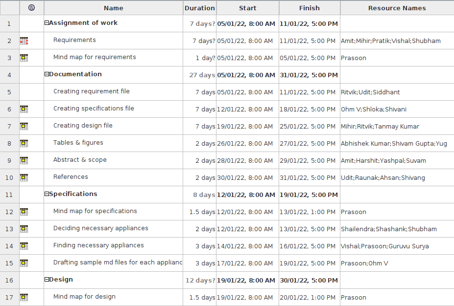
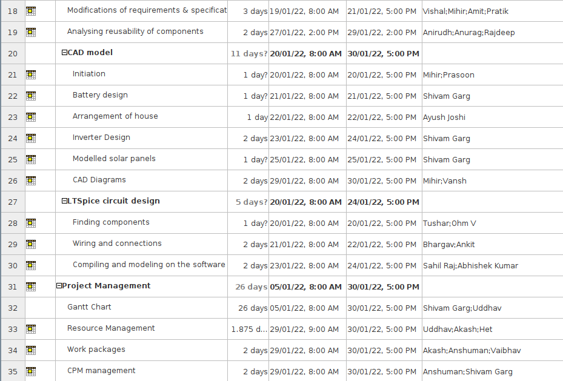

The following shows the resources available, a gear symbol against a name shows that they were involved in the project
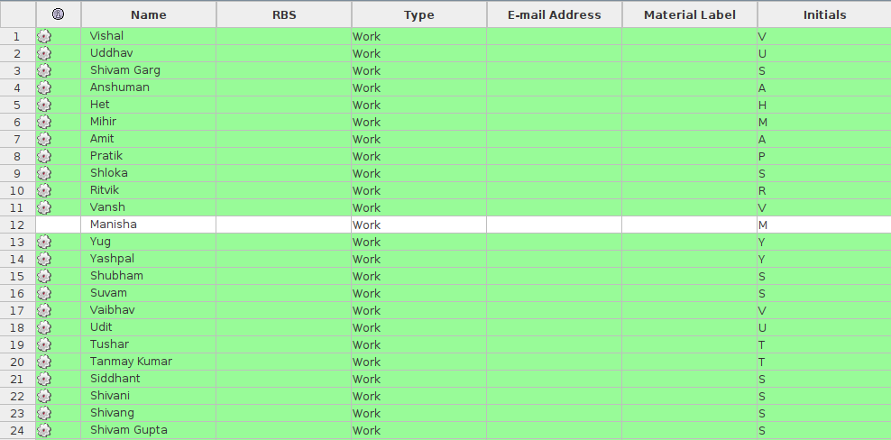
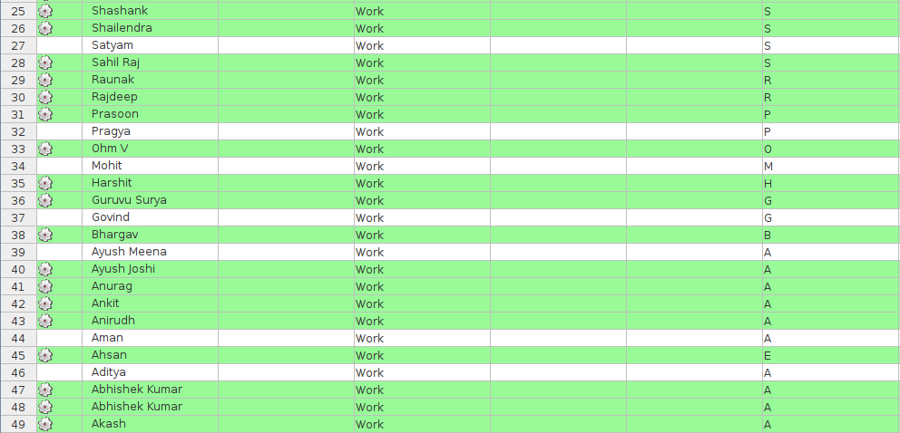

The following shows the work breakdown structure:
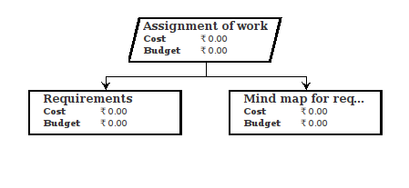
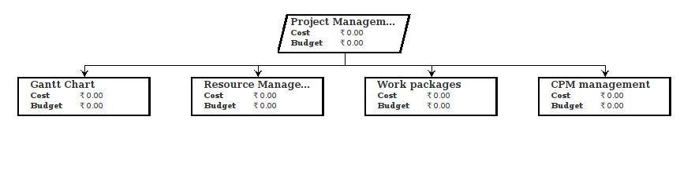
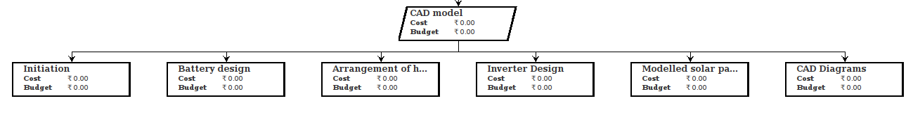
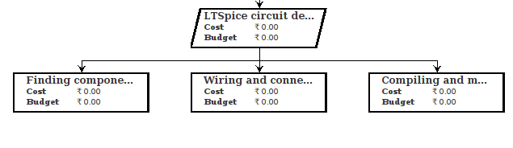
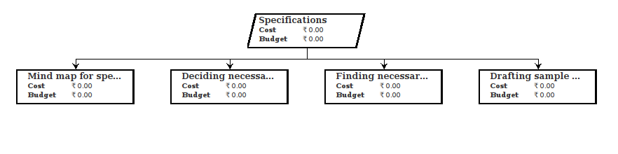
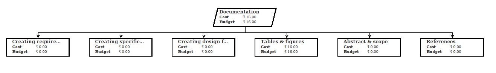
